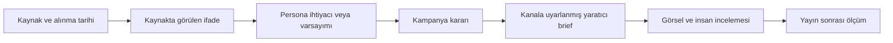

# Kampanya ve personaya bağlı sosyal görseller için araştırma ve üretim sistemi

Kaliteli sosyal görsel üretiminin merkezinde, seçilmiş bir hedef kitle ihtiyacını anlatan kampanya fikri bulunmalıdır. Marka kimliği bu fikri tanınabilir kılar; kanal uyarlaması ise aynı fikrin farklı kullanım bağlamlarında anlaşılmasını sağlar. Daha pahalı bir görsel modeli, belirsiz bir fikri veya eksik hedef kitle bilgisini kendiliğinden düzeltmez. Platformun savunulabilir değeri; kaynağı görülebilen bulgulardan, gerekçesi açıklanabilen yaratıcı kararlara ve ölçülebilir çıktılara geçişi düzenlemesidir.

Bu rapor, **14 Eylül 2026 itibarıyla erişilebilen birincil kaynakları** değerlendirir. Uygulama kapsamı LinkedIn, Instagram ve Facebook için **organik tek görselli gönderilerdir**. Ücretli reklamlar gerektiğinde ayrıca belirtilir; Reels, video, carousel ve Google banner kuralları bu kapsama otomatik aktarılmaz. Aşağıdaki üretim bütçeleri, test eşikleri ve kompozisyon tercihleri platform için önerilen başlangıç kararlarıdır; evrensel sektör standartları değildir.

## 1. Araştırmanın gerçekten desteklediği sonuçlar

| Konu | Kaynağın söylediği | Platform açısından sonuç | Kanıtın sınırı |
| --- | --- | --- | --- |
| LinkedIn | Mart 2026 duyurusu profesyonel ilgi, özgün bakış ve içerik alakasına vurgu yapıyor; genel, tekrar eden ve etkileşim tuzağı içeren gönderileri azaltmayı hedefliyor. | Görsel ve açıklama belirli bir iş durumuna veya faydalı fikre hizmet etmeli. | Bir illüstrasyon stilinin diğerinden iyi dönüşüm getireceğini göstermiyor. [1](https://news.linkedin.com/2026/ImprovingTheFeed) |
| Instagram | Resmî Best Practices alanı genel önerilere ek olarak hesaba özel öneriler içeriyor. | Kanal varsayımları hesap verisiyle güncellenebilmeli. | Bütün Instagram kullanıcılarının aynı estetiği istediği söylenemez. [2](https://about.fb.com/news/2024/10/best-practices-education-hub-creators-instagram/) |
| Facebook | Meta özgün üretimi desteklediğini; kopyalanmış içerik, ilgisiz açıklamalar ve dağıtımı manipüle eden davranışları azalttığını açıklıyor. | Rakip analizi yeni fikir üretmeli; rakibin görseline logo eklemek yeterli yaratıcı katkı sayılmamalı. | Video ağırlıklı açıklamalardaki sonuçlar tek görsel performansına taşınamaz. [3](https://about.fb.com/news/2026/03/rewarding-original-creators-on-facebook/), [4](https://about.fb.com/news/2025/04/cracking-down-spammy-content-facebook/) |
| Marka tutarlılığı | Ehrenberg-Bass araştırmacıları ayırt edici marka öğelerinin tutarlı kalmasını, yaratıcı mesajların ise gelişebilmesini ayırıyor. | Sabit marka varlıkları ile değişken sahne ve anlatım ayrı katmanlar olmalı. | Tek başına aynı renkleri kullanmak marka tanınırlığını ölçmez. [5](https://ipa.co.uk/knowledge/ipa-blog/three-common-mistakes-in-awards-entries/) |
| 2026 yaratıcı eğilimleri | Adobe duyusal ayrıntı, insani bağ, oyunbaz sürrealizm ve yerel bağlam yönlerini öne çıkarıyor. | Bunlar fikir geliştirme seçenekleri olarak kullanılabilir. | Bir tedarikçinin eğilim öngörüsüdür; zorunlu tasarım kuralı veya satış etkisi kanıtı değildir. [6](https://blog.adobe.com/en/publish/2025/12/09/four-creative-trends-define-marketing-2026) |

Bu kaynaklardan çıkan ortak yön, her görselin aynı “modern kurumsal tasarım” kalıbına sokulması değildir. Asıl ihtiyaç, niçin bu sahnenin seçildiğini ve hedeflenen kişinin hangi durumuyla ilişkilendirildiğini açıklayabilmektir. Kaynak bulunması ile yaratıcı fikrin doğru olması arasında hâlâ yorum vardır. Ürün bu yorumu görünür tutmalıdır.

## 2. Sabit marka, tutarlı kampanya, değişken yaratıcı uygulama

Üç ayrı karar düzeyi kullanılmalıdır. **Marka düzeyi** logo dosyası, onaylı renk rolleri, yazı tipi dosyaları, tipografik ağırlıklar ve ses tonudur. **Kampanya düzeyi** hedef, seçilmiş persona, temel ihtiyaç, ana önerme, doğrulanmış ürün/kurs bilgisi ve görsel fikirdir. **İçerik düzeyi** ise sahne, obje, bakış açısı, kısa metin ve kanal yerleşimidir.

Marka öğelerinin tanıma işlevi ile kampanya mesajının ikna işlevini ayırmak, tutarlılığı tekrara dönüştürmemeyi sağlar. Ward ve Sharp'ın açıklaması bu ayrımı açıkça destekler. Buradan türetilen ürün önerisi, bütün kampanyayı aynı fotoğrafın farklı renklerine indirgemeden, sınırlı sayıda tanınabilir marka öğesini korumaktır. [5](https://ipa.co.uk/knowledge/ipa-blog/three-common-mistakes-in-awards-entries/)

| Korunacak öğe | Değişebilecek öğe | Kontrol sorusu |
| --- | --- | --- |
| Güncel marka kimliği | Kadraj, ışık, ortam ve görsel yöntem | Logo kapatıldığında kalan tasarım hâlâ onaylı marka karakterine yakın mı? |
| Kampanyanın temel vaadi | Vaadin anlatıldığı günlük durum | Yeni görsel başka bir fayda veya sonuç vaat etmeye başlamış mı? |
| Seçilen persona ve ihtiyacı | İhtiyacın farklı bir anı veya itirazı | Değişiklik gerçek persona bilgisine mi, kanal klişesine mi dayanıyor? |
| Doğrulanmış kurs bilgisi | Bilginin kısa ifade biçimi | Kısaltırken koşul veya sınır kaybolmuş mu? |
| Kampanyanın görsel motifi | Motifin sahnedeki kullanımı | Benzerlik tanınırlık sağlıyor mu, yoksa aynı sahne tekrar mı ediliyor? |

Örneğin “konuşmayı başlatacak doğru soruyu bulmak” kampanya fikriyse, boş bir konuşma alanı veya iki kişinin arasındaki bekleme anı ortak motif olabilir. LinkedIn'de iş bağlamı, Instagram'da tek bir yakın plan ayrıntı, Facebook'ta daha geniş bir günlük sahne kullanılabilir. Bu ayrım bir platform gerçeği olarak değil, aynı fikrin test edilecek üç yorumu olarak kaydedilmelidir.

## 3. Persona bilgisinden yaratıcı içgörüye geçiş

Persona yalnızca yaş, unvan ve sektör toplamı olmamalıdır. İçerik üretimini doğrudan etkileyen bilgiler; yaşanan durum, yapılmak istenen iş, mevcut çözüm, engel, karar tetikleyicisi, itiraz ve kullanılan dildir. Yaş veya aile durumu ancak mesaj ya da erişim kararını değiştirdiğine dair gerekçe varsa kullanılmalıdır. NN/g'nin ayrımı da araştırılmamış persona varsayımları ile nitel araştırmaya dayanan personaların aynı şey olmadığını gösterir. [7](https://www.nngroup.com/articles/persona-types/)

Platformdaki 36 soruluk kayıt, bu bilgileri toplamak için uygundur; yaratıcı üretim çağrısına her yanıtı eşit ağırlıkla yığmak gerekmez. Her içerik için bir ana ihtiyaç, bir bağlam, bir engel ve bir sonraki adım seçilmelidir. Diğer yanıtlar çelişki kontrolü için tutulabilir. Belirsiz bir cevap yaratıcı üretim sırasında kesin hedef kitle gerçeğine yükseltilmemelidir.

Önerilen kanıt zinciri şöyledir:

Her geçişte açıklama gereklidir. Örneğin bir iş ilanında “paydaşlarla zor görüşmeler” ifadesi bulunması, bu görevin varlığına işaret edebilir. Bu, o roldeki herkesin kaygı yaşadığını, belirli yaşta olduğunu veya kurs satın almaya hazır olduğunu kanıtlamaz. Böyle bir psikolojik çıkarım **varsayım** olarak kalmalı; gerçek kullanıcı cümlesi gibi sunulmamalıdır.

GOV.UK araştırma rehberi gerçek kullanıcı ihtiyacını kanıttan çıkarmayı, paydaş görüşlerini ise araştırılacak varsayım olarak ele almayı önerir. Bu raporda bu yöntem pazarlama sürecine uyarlanır; kaynak bir reklam performans araştırması değildir. [8](https://www.gov.uk/service-manual/user-research/start-by-learning-user-needs)

Görsel briefindeki her önemli içgörü için `sourceId`, kaynak türü, kısa alıntı, tarih, yorum ve sınırlama saklanmalıdır. Alıntının kaynakta gerçekten bulunması bir **izlenebilirlik kontrolüdür**; alıntının hedef kitleyi temsil ettiğini veya çıkarımın doğru olduğunu tek başına kanıtlamaz. “Kullanıcı tarafından sağlandı”, “webde görüldü” ve “ölçümle doğrulandı” ürün dilinde ayrı tutulmalıdır.

## 4. Kanal uyarlaması nasıl yapılmalı?

### LinkedIn: profesyonel bağlamı anlaşılır kılmak

LinkedIn'in 2026 açıklaması, üyelerin mesleki ilgileriyle alakalı, somut bakış açısı ve uygulanabilir fikir içeren içerikleri öne çıkarma yönünü tarif ediyor. Bu nedenle bir kurs kampanyasında yalnızca diploma görseli yerine, eğitimin ilişkili olduğu gerçek bir iş durumu başlangıç adayıdır. Ancak LinkedIn görsellerinin mutlaka ciddi, koyu renkli veya metin dolu olması gerektiğine dair böyle bir kural yoktur. [1](https://news.linkedin.com/2026/ImprovingTheFeed)

Önerilen yaklaşım, görselin bir gerilimi veya soruyu göstermesi; açıklamanın ise kısa bir örnekle anlamı geliştirmesidir. Mizah, illüstrasyon veya metafor, mesleki bağlamı anlaşılır kıldığı sürece kullanılabilir. “Katılıyorsan yorum yap” yerine konuyla ilgili deneyimi davet eden gerçek bir soru tercih edilmelidir. Soru sormak da her içerikte zorunlu değildir.

### Instagram: görsel fikri hesaba göre sınamak

Instagram için başlangıç hipotezi, tek belirgin odak, dikkatle seçilmiş kısa metin ve açıklamayla tamamlanan görsel anlatımdır. Bunun gerekçesi platform kitlesine dair demografik bir varsayım değildir; küçük ekranda ilk mesajın anlaşılmasını kolaylaştıran bir tasarım seçimidir. Hesabın kendi gönderileri farklı bir örüntü gösteriyorsa öneri değişmelidir.

Instagram'ın resmî eğitim alanının hesaba özel tavsiyeler sunması, sabit “Instagram reçetesi” yerine bu esnekliği destekler. Kaydetme, paylaşma veya profil ziyareti gibi hedefler içerik amacına göre seçilebilir; erişilebilir metrikler hesabın mevcut araçlarından doğrulanmalıdır. Hashtag sayısını veya belirli bir estetiği başarı formülü olarak kodlamak bu kanıttan çıkmaz. [2](https://about.fb.com/news/2024/10/best-practices-education-hub-creators-instagram/)

### Facebook: görsel ile açıklamanın aynı hikâyeyi anlatması

Facebook için tanınabilir bir durum, açık bağlam ve içerikle ilgili bir sonraki adım başlangıç adayıdır. Meta'nın spam açıklaması özellikle görselle alakasız açıklamaları ve dağıtım kazanmak için kullanılan dikkat dağıtıcı hashtag davranışlarını ele alır. Bundan “her açıklama kısa olmalı” veya belirli sayıda hashtag yasaktır sonucu çıkarılamaz. [4](https://about.fb.com/news/2025/04/cracking-down-spammy-content-facebook/)

Facebook'un özgünlük yönelimi, rakiplerin paylaşımlarını inceleyip yeni bir bakış üretmeyi destekleyen bir çerçevedir. AI ile yeni bir dosya oluşturulması, platformun bunu nasıl sınıflandıracağını veya ne kadar dağıtacağını garanti etmez. İnsanların bulunduğu sahneler de gerçek katılımcı fotoğrafı veya gerçek mezun görüşü izlenimiyle sunulmamalıdır. [3](https://about.fb.com/news/2026/03/rewarding-original-creators-on-facebook/)

### Aynı kampanyanın üç farklı uygulaması

Aşağıdaki örnekler gerçek araştırma bulgusu veya belirli bir kurs iddiası değildir. Varsayımsal içgörü: kişi zor bir görüşmede ilk cümleyi bulmakta zorlanıyor. Ortak kampanya fikri: **“Een goed gesprek begint vóór je eerste zin.”** Kursun buna uygun pratik çalışma içerdiği ayrıca doğrulanmalıdır.

| Kanal | Görsel fikri | Görseldeki Hollandaca metin | Açıklamanın görevi |
| --- | --- | --- | --- |
| LinkedIn | İki iş arkadaşının görüşme öncesi duraklaması; aradaki boşluk ana motif | “Welke vraag opent het gesprek?” | Somut iş durumunu açmak, bir yaklaşım göstermek ve ilgili eğitime bağlamak |
| Instagram | İki sandalye arasındaki tek, belirgin boş konuşma biçimi; dokulu ve yalın sahne | “Even stil. Wat vraag je?” | Görselin anlamını doğal bir cümleyle tamamlamak; bir düşünme anı yaratmak |
| Facebook | Gündelik bir ortamda dinlemeye hazırlanan iki kişi; doğal etkileşim | “Een lastig gesprek hoeft niet groot te beginnen.” | Durumu bağlama oturtmak ve ilgilenen kişiye açık bir sonraki adım vermek |

Burada değişen kişi veya vaat değil, anlatım biçimidir. Her sahne aynı sorunla ilişkilidir. Platformdan beklenen gerekçe “Instagram olduğu için yaratıcı yaptım” değil, hangi öğenin hangi mesajı görünür kıldığıdır.

## 5. Görsel briefinin içermesi gereken kararlar

Design Council'ın yaklaşımı, problemi anlamak ve tanımlamak ile farklı çözümler geliştirmek ve küçük ölçekte sınamak arasında ayrım yapar. Platform açısından bunun karşılığı, doğrudan uzun bir görsel promptuna atlamadan önce ihtiyaç ve yaratıcı yönü seçmektir. [9](https://www.designcouncil.org.uk/resources/the-double-diamond/)

| Brief alanı | Yeterli cevap nasıl görünür? |
| --- | --- |
| Kampanya bağlantısı | Seçilmiş kampanya fikri ve bu parçanın onu nasıl ilerlettiği |
| Persona bağlantısı | Persona sürümü, kullanılan ihtiyaç ve varsa ilgili soru/yanıt |
| İçgörü ve kanıt | Gözlem, kaynak referansı ve hangi kısmın yorum olduğu |
| İçerik amacı | Fark ettirmek, açıklamak, itirazı azaltmak veya sonraki adıma yönlendirmek |
| Yaratıcı yöntem | İnsan anı, metafor, karşıtlık, beklenmedik ayrıntı veya görsel soru |
| Sahne | Kim/ne, nerede, ne yapıyor; belirgin obje ve ilişki |
| Kompozisyon | Ana odak, kadraj, bakış yönü, boşluk, metin alanı ve kırpılma sınırı |
| Görsel dil | Fotoğraf/illüstrasyon/nesne kompozisyonu; ışık, malzeme ve neden uygun olduğu |
| Metin | Kesin başlık, gerekirse tek alt satır; açıklamaya bırakılan bilgi |
| Marka uygulaması | Kullanılacak renk rolleri, gerçek fontlar, logo ve onaylı görsel motif |
| Kanal gerekçesi | Bu uygulamanın seçilen kanal ve gönderi amacıyla ilişkisi |
| Kaçınılacaklar | İlgisiz ofis klişesi, yanlış ürün iddiası, tekrar eden sahne gibi somut sınırlar |
| Test hipotezi | Bu uygulama hangi anlama veya davranışa yardımcı olabilir; nasıl kontrol edilecek? |

“Premium, high quality, modern, creative” gibi sıfatlar bu alanların yerine geçmez. Adobe'nin 2026 örnekleri de belirli insan etkileşimleri, materyaller ve kurulmuş sahneler üzerinden anlatılır. Buradan alınacak yararlı fikir daha çok sıfat eklemek değil, görselde ne olduğunu tarif etmektir. Sürrealizm yalnızca mesajı güçlendiriyorsa seçilmelidir. [10](https://blog.adobe.com/en/publish/2026/01/08/how-creators-leveraging-adobe-2026-creative-trends)

Konuşma balonu bir anlatım seçeneğidir. Sahnedeki kişiye aitmiş gibi duran söz, gerçek bir referans veya katılımcı görüşü olarak sunulmamalıdır. Balonun kime yöneldiği, yüzü kapatıp kapatmadığı ve metnin gözle okunup okunmadığı kontrol edilmelidir. Her kampanyaya balon koymak mevcut standart ofis fotoğrafının yerine yeni bir standart şablon yerleştirir.

## 6. Güncel marka ve teknik format nasıl korunmalı?

Kesin logo, metin ve renklerin görsel modelinden çizmesini istemek yerine bunları renderer üzerinden yerleştirmek platformun mevcut yaklaşımıyla uyumludur. Sahne doğal ışık ve malzeme renkleri içerebilir; grafik katmanlar onaylı marka rollerini kullanmalıdır. Bütün ciltleri ve arka planı ana marka rengine boyamak gerekmez. Font adının kayıtta bulunması ile gerçek font dosyasının yüklenmesi farklı kontrollerdir.

W3C normal metin ve metin görüntüleri için en az 4.5:1; uygun büyük metin için 3:1 kontrast tanımlar. Platformun tüm bilgilendirici bindirmelerde 4.5:1 kullanması muhafazakâr bir üretim tercihidir; tek başına tam erişilebilirlik uygunluğu anlamına gelmez. Doğru kontrastın yanında gerçek mobil görünümde punto, satır kırılması ve metnin arka planla ilişkisi de incelenmelidir. [11](https://www.w3.org/WAI/WCAG22/Understanding/contrast-minimum.html)

Organik LinkedIn fotoğraf yardımında yükleme sınırı 5 MB, minimum boyut 552 × 276, önerilen genişlik 1080 piksel ve oran aralığı 3:1–4:5 olarak belirtiliyor. Aynı kaynak alternatif metin eklemeyi destekliyor. Bunlar okunmuş organik fotoğraf bilgileridir; bütün kanallar için ortak bir “2026 ölçüsü” değildir. [12](https://www.linkedin.com/help/linkedin/answer/a527229/sharing-photos-or-videos?lang=en)

LinkedIn ücretli tek görsel reklamları ayrı özelliklere sahiptir; örneğin portre reklamların mobil dağıtım ayrımı vardır. Meta Ads Guide sayfaları bu araştırmada giriş ekranına yönlendi; Instagram fotoğraf çözünürlüğü sayfası ise 429 yanıtı verdi. Bu nedenle bu kaynaklardan doğrulanmamış sayısal limit veya evrensel güvenli alan çıkarılmamalıdır. Organik çıktı, sonradan ücretli kampanyaya alınırken ilgili placement profiline yeniden doğrulanmalıdır. [13](https://www.linkedin.com/help/lms/answer/a426534/), [14](https://www.facebook.com/business/ads-guide/image/instagram-feed), [15](https://www.facebook.com/business/ads-guide/image/facebook-feed)

Web sitesinde aynı içerik kullanıldığında, mümkünse metin HTML olarak korunmalıdır. Sosyal görselin anlamlı metni açıklamada veya uygun alternatif metinde de erişilebilir olmalıdır. W3C'nin metin görüntüleri rehberi, uygun teknoloji varken gerçek metin kullanımını esas alır. [16](https://www.w3.org/WAI/WCAG22/Understanding/images-of-text.html)

## 7. Gerçek araştırma yapan, maliyeti sınırlı üretim akışı

Her görsel için yeniden açık web araştırması ve ayrı strateji çağrısı yapmak yerine, kampanya için bir kez **yaratıcı araştırma kaydı** hazırlanmalıdır. Mevcut Market Radar sonuçları, kaynaklı persona yanıtları, doğrulanmış kurs bilgileri, onaylı brief ve marka sürümü bunun başlangıcıdır. Eksik bilgi araştırılır; mevcut bilgi tekrar tekrar özetlenmez.

Önerilen başlangıç bütçesi: en fazla üç doğrudan rakip, altı arama sorgusu ve toplam on iki ilgili sayfa. Görsel inceleme gerekiyorsa kısa listeye alınmış en fazla altı referans yeterli bir pilot sınırıdır. Bunlar optimum olduğuna dair araştırma sonucu değil, maliyeti görünür tutan ürün ayarlarıdır. Kullanıcıya kapsam, bulunan bilgi, eksik kalan alan ve genişletmenin tahmini maliyeti gösterilmelidir.

Rakip kaydında başlık, teklif, hedeflenen durum, CTA, görsel yöntem, tarih ve kaynak tutulmalıdır. Yalnızca sayfa metni alınmışsa kayıt “görsel incelendi” dememelidir. Bir reklamın arşivde bulunması; bütçesini, hedeflemesini veya başarısını göstermez. Rakibin çok benzer üç paylaşımı da üç bağımsız hedef kitle kanıtı sayılmaz.

Araştırma sonucunda önce iki veya üç kısa yaratıcı yön gösterilebilir. Kullanıcının seçtiği yön, mevcut içerik üretim çağrısında kanal brieflerine dönüştürülür. Yalnızca seçilmiş çıktıların sahneleri üretilir; aynı sahnenin renk ve metin düzeni değişiklikleri yeniden görüntü üretimi gerektirmemelidir. Bu, Meta'nın ücretli reklam eğitimindeki görsel ve mesaj çeşitliliği yaklaşımından yararlanır; eğitim herhangi bir zorunlu varyant sayısı koymaz. [17](https://www.facebookblueprint.com/student/activity/707402)

| İş | İlk bütçe/cache önerisi | Yeniden çalıştırma nedeni |
| --- | --- | --- |
| Kurs ve marka | Sürüm, içerik özeti ve dosya hash'i üzerinden kullan | Kurs bilgisi veya marka sürümü değişmesi |
| Rakip sayfaları | Yedi günlük inceleme süresi; URL ve içerik hash'i ile tekilleştirme | Yeni kampanya sinyali, kullanıcı yenilemesi veya süre dolması |
| Kanal rehberi | Tarihli, kaynaklı ortak kayıt; aylık kontrol ve değişiklik duyurusunda yenileme | Resmî rehber veya placement değişmesi |
| Persona özeti | Persona sürümüne bağlı türetilmiş kayıt | İlgili yanıt veya kanıt değişmesi |
| Yaratıcı araştırma | Kampanya/brief/concept/persona/marka sürümlerinden anahtar | Bu girdilerden biri veya kullanılan kaynak değişmesi |
| Görsel | Sahne, boyut, model ayarı ve referansların hash'i | Sahne ya da gerekli format değişmesi |
| İnceleme | Önce kod kontrolleri; seçilmiş final için isteğe bağlı görsel değerlendirme | Final bitmap veya rubrik sürümü değişmesi |

Cache bir güncellik garantisi değildir. Özellikle tarihler, fiyatlar ve geçici teklifler yayın öncesi yeniden doğrulanmalıdır. Eski araştırma yeni sürüme sessizce taşınmamalı; kayıt “bu sürüm bu kaynaklara dayanıyordu” diyebilmelidir. Başarısız araştırma da otomatik sonsuz denemeye dönüşmemeli; eksik alan belirtilmelidir.

Maliyet raporu arama/fetch sayısı, model girdisi/çıktısı, görüntü sayısı, cache kullanımı ve yeniden üretim nedenini ayrı göstermelidir. Görsel hata için bir otomatik düzeltme turu başlangıç sınırı olabilir. Sonraki tur kullanıcı tarafından seçilmelidir; araştırma ve üretim işlerinin aynı istek anahtarıyla tekrarlanması tekrar ücret doğurmamalıdır. Bunlar platforma önerilen mühendislik kontrolleridir.

## 8. Kalite değerlendirmesi: geçiş kontrolleri ve insan yorumu

Tek bir “AI quality 94/100” puanı üretmek yerine, doğrulanabilen kontroller ile editoryal değerlendirme ayrılmalıdır. **Teknik geçiş kontrolleri** doğru kaynak sürümleri, yüklenen font/logo, palette uygunluk, kontrast, boyut, metin taşması ve eksik zorunlu alanlardır. Persona içgörüsünün kaynakla gerçekten ilgili olması ve görüntünün anlamı ise yalnızca şema doğrulamasıyla çözülemez.

Aşağıdaki rubrik pilot için önerilir. Her boyutta **0: düzeltme gerekli, 1: kısmen yeterli, 2: açıkça yeterli** kullanılır; görülmeyen veya ölçülmeyen özellik “değerlendirilmedi” kalır. Puan bir tıklama veya dönüşüm tahmini değildir. Değerlendirici kısa gerekçe ve işaret ettiği görsel/metin öğesini kaydetmelidir.

| Boyut | 2 puan için gözlenebilir ölçüt |
| --- | --- |
| Persona ilişkisi | Ana durum seçilmiş persona kaydına bağlanıyor; varsayım gizlenmiyor |
| Kampanya bütünlüğü | Görselin ana anlamı kampanya vaadiyle uyumlu; yeni iddia eklenmiyor |
| Mesajın anlaşılması | İnceleyen kişi, beklenen ana fikri yönlendirilmeden kendi sözleriyle söyleyebiliyor |
| Görsel fikir | Kullanılan obje/eylem mesajın anlaşılmasına katkı sağlıyor; süs olarak kalmıyor |
| Marka tutarlılığı | Doğru varlıklar yüklenmiş; yerleşim, renk rolleri ve ses tonu onaylı kimlikle uyumlu |
| Kanal ve format | Gerekçe belirli; gerçek feed boyutunda kritik öğeler ve metin okunabiliyor |
| Uygulama kalitesi | İstenmeyen AI yazısı, belirgin anatomi hatası, yanlış gölge veya sorunlu kırpılma yok |
| Görsel–açıklama ilişkisi | İkisi aynı fikri geliştiriyor; önemli vaat açıklamada değiştirilmemiş |
| Sonraki adım | İstenen davranış içerik amacıyla uyumlu, açık ve uygulanabilir |

İlk insan referansı, aynı brief için mevcut üretim, yeni üretim ve bir insanın düzenlediği örneğin karşılaştırılması olabilir. Görsellerin sırası karıştırılmalı; hangi modelin yaptığı saklanmalı; kısa gösterimden sonra “Ne anlatıyor?”, “Kimin için?”, “Hangi marka?”, “Sonra ne yapardın?” sorulmalıdır. Beş–sekiz ilgili katılımcı bir pilotta yanlış anlamaları bulmaya yardımcı olabilir; bu sayı kampanya etkisini istatistiksel olarak kanıtlamaz. GOV.UK küçük nitel araştırma ile daha büyük örneklem gerektiren A/B ölçümünü ayırır. [18](https://www.gov.uk/service-manual/user-research/plan-user-research-for-your-service)

Başka bir modelden değerlendirme almak yararlı bir ikinci kontrol olabilir. Ancak LLM-as-a-judge araştırması sıra, uzunluk ve kendi çıktısını kayırma gibi yanlılıkları gösterir; çalışma sohbet yanıtlarını değerlendirir, sosyal görseller için dönüşüm tahmini doğrulamaz. Bu nedenle görsel inceleme gerçek bitmap üzerinden yapılmalı, model insan rubriğine karşı kalibre edilmeli ve persona tepkisi “simülasyon” olarak gösterilmelidir. [19](https://arxiv.org/abs/2306.05685)

## 9. Değer ve performans nasıl kanıtlanabilir?

İlk ölçülebilir değer, üretim süresinin ve yeniden düzenleme ihtiyacının azalmasıdır. Onaylanmış içerik başına harcanan süre, maliyet, revizyon sayısı, kaynak bulunabilirliği ve teknik hata oranı kaydedilebilir. “Daha güzel” yorumundan farklı olarak bunlar platformun çalışma kalitesini ölçer. Sonuçlar gerçek ölçüm başlamadan kazanç yüzdesi olarak sunulmamalıdır.

Yayın sonrası erişim, etkileşim ve iş sonucu ayrı tutulmalıdır. LinkedIn organik gönderi analitiğinde gösterim, ulaşılan üyeler, tıklama oranı, tepkiler, yorumlar ve yeniden paylaşım gibi alanlar bulunur. Bunların hiçbiri tek başına kurs kaydı değildir. Kampanya hedefi uygunsa ilgili site ziyareti, bilgi talebi veya kayıt ölçümüyle ilişki kurulmalıdır. [20](https://www.linkedin.com/help/linkedin/answer/a563045)

Organik gönderilerin farklı gün ve saatlerde karşılaştırılması kontrollü deney sayılmaz. Kitle büyüklüğü, konu, dağıtım, yayın zamanı ve başka kampanyalar sonucu etkileyebilir. A/B testinde bile önce “farklı fikir mi, farklı metin mi, farklı düzen mi?” sorusu belirlenmelidir. Aynı görüntünün iki renk varyantını karşılaştırmak, iki yaratıcı konsepti sınamak değildir.

Araştırmaların bağlamı da korunmalıdır. Örneğin Williams ve arkadaşlarının çalışması televizyon reklamlarında yaratıcı değişkenler ile satış sonuçlarını inceler; açık özet, kullanılan analiz yöntemlerinin sonuçları etkileyebildiğine dikkat çeker. Buradaki bulguları doğrudan organik Instagram tek görseline taşıyıp logo konumu veya satış artışı kuralı üretmek uygun değildir. Bu raporda makale, değerlendirmede yöntem ve bağlamın önemini göstermek için kullanılmıştır; tam metin erişimi yoktur. [21](https://journals.sagepub.com/doi/abs/10.1177/14707853221134258)

## 10. Mevcut platforma uygulama sırası

Mevcut temelde yapılandırılmış `creativeBrief`, sürümlü kampanya bağlamı, görselden ayrı metin/logo yerleştirme, marka dosyaları, renk/taşma kontrolleri ve içerik kartındaki **Creatieve beeldbrief** görünümü bulunuyor. Ayrıntılı uygulama durumu [Social creative direction](social-creative-direction-2026.md) belgesinde tutuluyor. Bu rapordaki yeni akış önerileri otomatik olarak tamamlanmış özellik veya canlı model doğrulaması sayılmamalıdır.

**14 Eylül’de uygulanan ek kapsam:** Sosyal görsel üretimi öncesinde kampanya için ortak bir kaynak dosyası hazırlanıyor. Kaynaklı persona bilgisi, mevcut güncel kurs araştırması ve kampanyaya bağlı radar kullanılıyor; en fazla iki ilgili radar sayfası yeniden okunabiliyor. Yeni bir AI araması yapılmıyor. Kaynaklar, tarihler, yorumlar ve bilgi eksikleri görselle saklanıyor; geçerli kayıt değişmeyen girdilerle en fazla yedi gün kullanılıyor. Kanal gerekçesi, kampanya bağlantısı, persona ve kaynak kimlikleri ile test hipotezi briefin parçası. **Onderbouwing & kanaalkeuze** bunları gösteriyor. Yanlış kaynak kimliği ve yanlış kanal/aşama yanıtları kaydedilmiyor. Eski araştırma korunurken üretim girdileri değişmişse ekranda tarihsel kayıt olduğu belirtiliyor. CS’nin okunaklı marka renk çifti görsel çağrısından önce seçiliyor; gerçek beyaz logo gerektiğinde onaylı koyu bir zemin alıyor.

Bu kapsam, aşağıdaki daha geniş yol haritasının ilk bölümüdür. Rakip görsellerinin otomatik görsel analizi, ayrı araştırma projesi/yenileme ekranı, insan referans seti, kalibre edilmiş model değerlendirmesi ve canlı performansla optimizasyon henüz bu adımın parçası değildir. [Platform uygulama kaydı](../PLATFORM.md) teknik durumu açıklar.

| Öncelik | Düzenleme | Kabul ölçütü |
| --- | --- | --- |
| İlk | Araştırma, persona ve kampanya bağlantısını final görselle saklamak | “Neden bu görsel?” ekranından kullanılan ihtiyaç ve kaynağa ulaşılabiliyor |
| İlk | Ortak kampanya fikri + kanal gerekçesi | Kanal değişirken persona ve temel vaat korunuyor; değişen anlatım açıklanıyor |
| İlk | Gerçek kaynak incelemesi ile editoryal rehberi ayırmak | Okunmamış görsel “analiz edildi” görünmüyor; performans bilinmiyorsa yazılmıyor |
| İlk | Mobil boyutta inceleme ve deterministik marka kontrolleri | Font, logo, taşma ve kontrast hataları teslim öncesi görünür |
| Sonraki | Kısa yaratıcı yön seçimi ve tekrar kontrolü | Yeni fikir, metin varyantı ve düzen varyantı ayrı gösteriliyor |
| Sonraki | Araştırma cache'i ve maliyet kaydı | Değişmeyen kampanya bağlamı tekrar araştırılmıyor; ücretin nedeni izlenebiliyor |
| Sonraki | İnsan referans seti ve kalibre model değerlendirmesi | Değerlendirme gerekçeli; görüş ayrılığı ve belirsizlik saklanıyor |
| Ölçümle | Hesap analitiği ve iş sonucu entegrasyonu | Kanal önerileri gerçek performansla güncelleniyor; varsayım ile ölçüm ayrılıyor |

Sunumda gösterilecek örnek, tek bir güzel çıktıdan daha kapsamlı olmalıdır: kaynaklı bulgu, seçilmiş persona ihtiyacı, kampanya kararı, üç kanal yorumu, marka kontrolü ve inceleme kaydı aynı zincirde görünmelidir. Böylece iddia, “AI bunun iyi olduğunu söyledi” yerine, **bu girdilerden bu kararlar alındı; üretim şu kontrollerden geçti; kalan performans hipotezi şu şekilde sınanacak** olur.

## Kaynaklar ve erişim bilgileri

Kaynaklar 14 Eylül 2026 tarihinde kontrol edildi. Göreli “bir ay önce” gibi yardım merkezi tarihleri kesin takvim tarihine çevrilmedi. Duyuru veya rehberdeki tarih ile raporun erişim tarihi farklıdır. Aşağıdaki kaynaklar platform açıklaması, araştırmacı makalesi, standart veya yöntem rehberidir; aynı kanıt ağırlığına sahip değildir.

| No. | Kaynak ve tarih | Kullanım |
| --- | --- | --- |
| 1 | LinkedIn, [How LinkedIn Is Improving the Feed to Show More Relevant, Authentic Professional Content](https://news.linkedin.com/2026/ImprovingTheFeed), 12 Mart 2026 | Güncel organik içerik yönelimi |
| 2 | Meta, [Introducing Best Practices, an Education Hub for Creators on Instagram](https://about.fb.com/news/2024/10/best-practices-education-hub-creators-instagram/), sayfada 1 Ekim / 30 Eylül 2024 tarihleri | Hesaba özel önerilerin varlığı |
| 3 | Meta, [Rewarding Original Creators on Facebook](https://about.fb.com/news/2026/03/rewarding-original-creators-on-facebook/), sayfada 13 / 12 Mart 2026 tarihleri | Özgünlük yönelimi; video örneklerinin sınırı |
| 4 | Meta, [Cracking Down on Spammy Content on Facebook](https://about.fb.com/news/2025/04/cracking-down-spammy-content-facebook/), 24 Nisan 2025; ayrıca 22 Ekim 2025 tarihi | İlgisiz açıklama ve spam davranışı |
| 5 | Ella Ward ve Byron Sharp, IPA, [Three common mistakes in awards entries](https://ipa.co.uk/knowledge/ipa-blog/three-common-mistakes-in-awards-entries/), 10 Eylül 2024; güncelleme 14 Mayıs 2025 | Ayırt edici marka varlıkları ve yaratıcı mesaj ayrımı |
| 6 | Lia Haberman, Adobe, [Four creative trends that will define marketing in 2026](https://blog.adobe.com/en/publish/2025/12/09/four-creative-trends-define-marketing-2026), 9 Aralık 2025 | Ticari eğilim öngörüsü |
| 7 | Page Laubheimer, NN/g, [3 Persona Types: Lightweight, Qualitative, and Statistical](https://www.nngroup.com/articles/persona-types/), 21 Haziran 2020 | Persona türleri ve araştırma temeli |
| 8 | GOV.UK, [Learning about users and their needs](https://www.gov.uk/service-manual/user-research/start-by-learning-user-needs), 4 Nisan 2016; güncelleme 23 Mart 2017 | Kanıttan ihtiyaç çıkarma yöntemi |
| 9 | Design Council, [The Double Diamond](https://www.designcouncil.org.uk/resources/the-double-diamond/), sayfada kesin yayın tarihi yok | Problemi anlama, fikir geliştirme ve sınama |
| 10 | Brenda Milis, Adobe, [How creators are leveraging Adobe's 2026 creative trends](https://blog.adobe.com/en/publish/2026/01/08/how-creators-leveraging-adobe-2026-creative-trends), 8 Ocak 2026 | Somut yaratıcı örnekler; performans kanıtı değil |
| 11 | W3C, [Understanding SC 1.4.3: Contrast (Minimum)](https://www.w3.org/WAI/WCAG22/Understanding/contrast-minimum.html), WCAG 2.2 açıklama sayfası | Kontrast gereksinimi |
| 12 | LinkedIn Help, [Share photos on LinkedIn](https://www.linkedin.com/help/linkedin/answer/a527229/sharing-photos-or-videos?lang=en), göreli güncelleme tarihi | Organik fotoğraf ve alternatif metin |
| 13 | LinkedIn Help, [Single image ads specifications](https://www.linkedin.com/help/lms/answer/a426534/), göreli güncelleme tarihi | Ücretli reklam ayrımı |
| 14 | Meta Ads Guide, [Instagram Feed image](https://www.facebook.com/business/ads-guide/image/instagram-feed), giriş ekranına yönlendi | Sayısal özellikler bu kaynaktan doğrulanamadı |
| 15 | Meta Ads Guide, [Facebook Feed image](https://www.facebook.com/business/ads-guide/image/facebook-feed), giriş ekranına yönlendi | Sayısal özellikler bu kaynaktan doğrulanamadı |
| 16 | W3C, [Understanding SC 1.4.5: Images of Text](https://www.w3.org/WAI/WCAG22/Understanding/images-of-text.html), WCAG 2.2 açıklama sayfası | Canlı metin ve metin görüntüsü ayrımı |
| 17 | Meta Blueprint, [Ad creative that converts: how to diversify your ads for better results](https://www.facebookblueprint.com/student/activity/707402), 18 Mayıs 2026 | Ücretli yaratıcı çeşitlilik; eğitim tanıtım sayfası incelendi |
| 18 | GOV.UK, [Plan user research for your service](https://www.gov.uk/service-manual/user-research/plan-user-research-for-your-service), 14 Mart 2016; güncelleme 21 Eylül 2018 | Araştırma yöntemi, maliyet ve örneklem ayrımı |
| 19 | Zheng ve arkadaşları, [Judging LLM-as-a-Judge with MT-Bench and Chatbot Arena](https://arxiv.org/abs/2306.05685), ilk sürüm 9 Haziran 2023; v4 24 Aralık 2023 | Model değerlendiricilerinin sınırları; sohbet değerlendirmesi |
| 20 | LinkedIn Help, [LinkedIn Page posts FAQ](https://www.linkedin.com/help/linkedin/answer/a563045), göreli güncelleme tarihi | Organik gönderi metrikleri |
| 21 | Williams, Hartnett ve Trinh, [Finding creative drivers of advertising effectiveness with modern data analysis](https://journals.sagepub.com/doi/abs/10.1177/14707853221134258), ilk çevrimiçi yayın 14 Ekim 2022; 2023 cilt 65(4) | Açık özet okundu; TV araştırmasının bağlam sınırı |

Instagram'ın [fotoğraf çözünürlüğü yardım sayfası](https://help.instagram.com/1631821640426723) bu kontrolde 429 yanıtı verdi. Bu nedenle üçüncü taraf ölçü tablolarındaki yeni oranlar doğrulanmış organik Instagram kuralı olarak kullanılmadı. Gerçek hesaba ait analitik, canlı reklam sonuçları ve hedef kitle görüşmeleri bu raporun veri setinde bulunmuyor.
